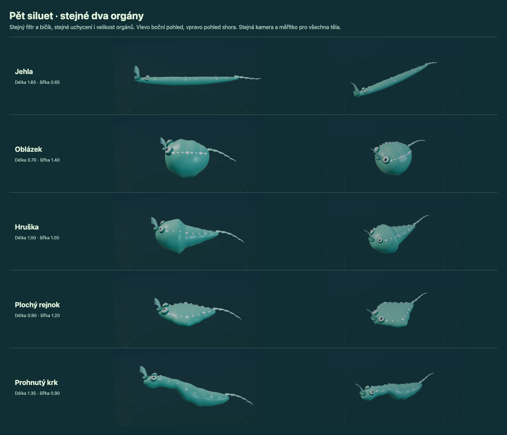

# Sedm článků přímo na 3D těle

Kliknutí na povrch vybere článek. Zlatý pás, číslo a popisek označují stejnou upravovanou oblast; přesné posuvníky šířky, výšky a ohybu zachovávají krok 0,05. Pravé tažení otáčí kamerou, levé tažení orgánu přesouvá jeho uchycení. Klik na tělo také přivede odrolované posuvníky zpět do záběru. Samotný výběr nemění genom, cenu, historii ani save.



Všechna těla vznikla běžným UI od Nové linie se seedem 67. Mají přesně shodný filtr a bičík včetně velikosti, polohy a symetrie, stejnou barvu a vzor. Kamera a měřítko jsou společné. Vlevo pohled z boku, vpravo zvýšený šikmý pohled.

| Silueta | Délka | Celková šířka | Cena / 36 DNA |
| --- | ---: | ---: | ---: |
| Jehla | 1,65 | 0,65 | 36 |
| Oblázek | 0,70 | 1,40 | 31 |
| Hruška | 1,00 | 1,00 | 25 |
| Plochý rejnok | 0,90 | 1,20 | 28 |
| Prohnutý krk | 1,35 | 0,90 | 30 |

Rozsahy editoru stačily bez rozšíření. Nepřibyly orgány ani etapy. Sedm průřezů všech těl je v [reprodukovatelných vstupech](../../tests/fixtures/body-silhouettes.ts).

## Ověření přesného publikovaného obsahu

- 100 testovacích souborů, **1 956 testů**, typecheck a produkční build prošly v izolované kopii obsahu commitu.
- Chromium **5/5**: všech sedm přímých výběrů na každé siluetě, přesné hodnoty posuvníků, klid/pohyb/krmení, potvrzení, pohyb, export/import, refresh/load a zrušení. Klávesové úpravy, tažení posuvníku i přetažení orgánu prošly s undo/redo; rovněž pointercancel a 1280×720. Žádné browser chyby.
- Testy pokrývají uchycení všech stávajících druhů orgánů včetně zrcadlení na pěti profilech, oči, konečné animace, podlahu, boční stěnu, konečný strop, uvolnění zvýraznění, save a obnovu generace.
- Původní nezměněná charakterizace editoru 5/5 a úplný pracovní strom 1 969 testů prošly před oddělením nesouvisejících úprav questů a dechu. Tyto úpravy nejsou součástí publikovaného commitu.

```sh
pnpm install --frozen-lockfile
pnpm dev --port 5183
# V dalším terminálu:
pnpm test:body-editor
pnpm test
pnpm build
```

Browser skript zapisuje nové důkazy do ignorovaného `evidence/body-editor/browser/`. `LUMAVORA_URL` mění server, `BODY_EDITOR_OUTPUT` výstupní složku. Browser scénáře používají DEV krokování času světa; nejde o nový úplný průchod kampaní nebo test Safari/telefonu. Kolize zachovávají původní zjednodušený objem podle příčného průřezu, nikoli přesné kolize celé délky těla a orgánů. Starší genomy bez profilu zůstávají kompatibilní; migrace není potřeba.

## SP-002: konstrukce suchozemského tvora (genom v2)

Na souši otevři u kolébky **Tab → Upravit kostru**. Panely **Tělo / Části / Povrch** umožňují upravovat obratle, končetiny, klouby, chodidla, ruce a více úst. Klik vybere skutečné madlo; levé tažení nebo šipky jej upraví, pravé tažení otáčí pohled a kolečko přibližuje. Číselná pole podporují klávesnici. Zrcadlený pár je jeden záznam a jeho cena zahrnuje oba členy. Povrch je kosmetický.

**Stavba / Zkouška** přepíná mezi konstrukcí a odděleným náhledem. Chůze, skok, kousnutí a hlas či gesto vycházejí ze stejných schopností jako tělo v krajině. Nedostupná akce ukazuje důvod; kousnutí potřebuje skutečný kontakt s terčem. Zkouška nemění kampaň ani DNA. Na souši **Q** skáče a **V** komunikuje; samotné držení klávesy neopakuje akci.

První konstrukční změna převádí pouze návrh do v2; **Zrušit** ponechá instalovaný v1. Undo/redo zahrnuje celý genom, samotný výběr historii nemění. Potvrzení ověřuje postoj, vybavení a rozpočet. Zobrazená cena je celková investice těla; dostupné DNA po potvrzení jsou celková alokace minus tato cena. Obsazené partnerské lůžko nelze odstranit.

Původní text a čísla výše popisují historický editor v1. V2 má vlastní sdílenou anatomii a konzervativní kolizní obálku celého trupu; končetiny a orgány nejsou samostatná fyzikální tělesa. Podrobnosti ověření, připravené konstrukce, skutečně získaný rozpočet a omezení jsou v [reportu SP-002](../spore/SP-002-REPORT.md).

```sh
LUMAVORA_URL=http://127.0.0.1:5183 pnpm test:creature-editor
```

Výstup je `evidence/sp-002/browser`, přepis `CREATURE_EDITOR_OUTPUT`; trace se ukládá pouze s `LUMAVORA_TRACE=1`. Skript používá běžné UI a skutečný browser čas. Připravená konstrukční/performance data jsou označena odděleně od hraného checkpointu. Lidský test bez instrukcí ani poslech dosud neproběhl.
